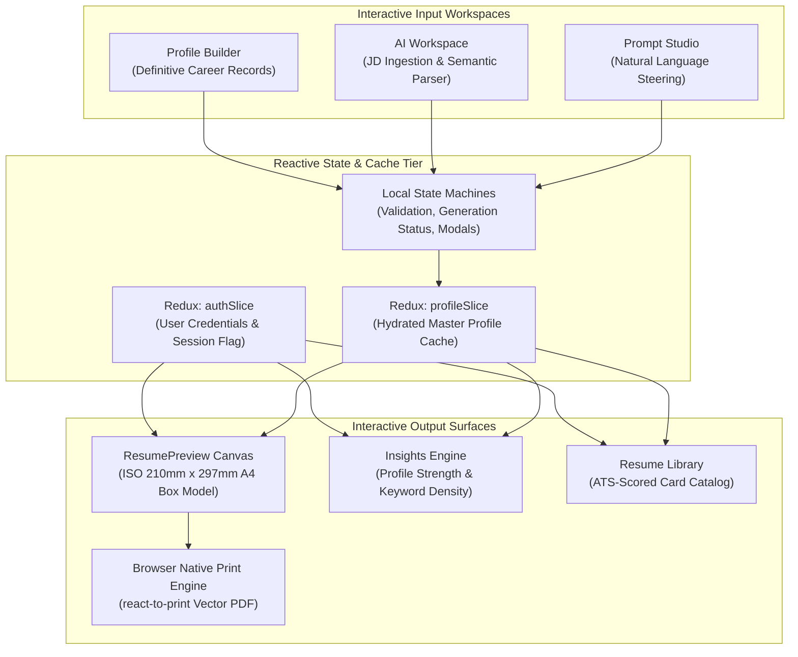
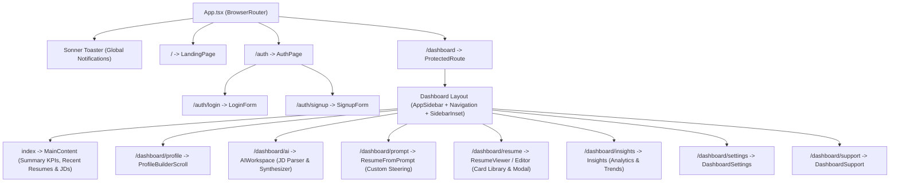
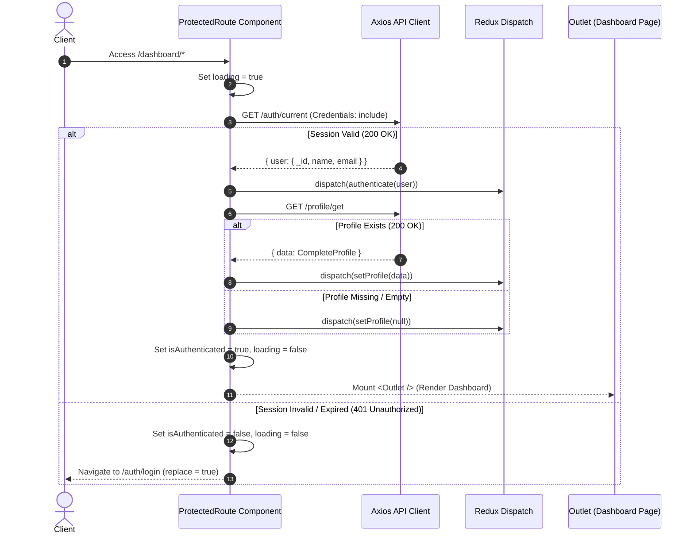
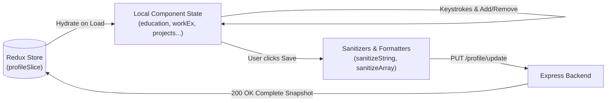
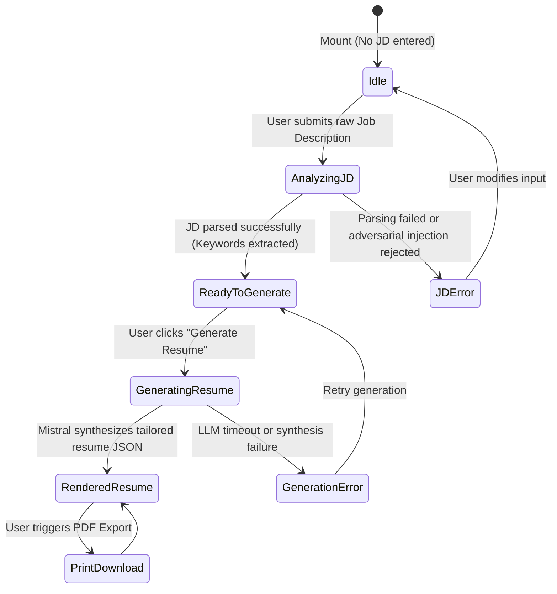
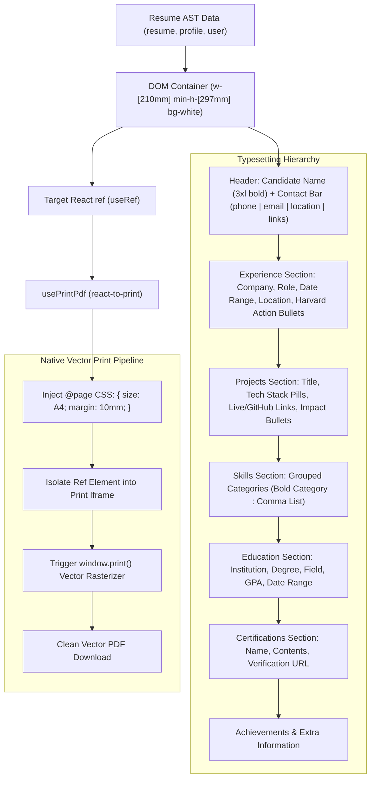

# Frontend Architecture & Client Engineering Blueprint

> **A reactive, high-precision career workstation, dynamic resume synthesizer, and sub-millimeter print canvas.**  
> Built with React 18, TypeScript, Tailwind CSS, shadcn/ui, Redux Toolkit, and native browser vector printing.

---

## 1. Frontend Mental Model & UI Philosophy

The frontend is not a simple form collection or a generic dashboard. It operates as an **interactive compiler IDE**:



### Key UI Decisions
- **Zero Document Jitter**: Resume editing and previewing are coupled to fixed ISO A4 geometry (`210mm x 297mm`). The user sees the exact physical artifact that will be printed or parsed by ATS engines.
- **Optimistic Reactivity with Server-Validated Safety**: Master profile changes validate locally with instant regular expression feedback (phone digits, LinkedIn/GitHub URL patterns) and sanitize whitespace before dispatching payload updates.
- **Multi-Pane Split Workstations**: In the AI Workspace, context is maintained by keeping the target Job Description analysis visible on the left pane while the synthesized resume and ATS metrics render on the right pane.

---

## 2. Route Architecture & Bootstrap Sequence

The application routes are structured with nested layouts, separating public landing and onboarding routes from protected career workspace routes.



### Protected Route Hydration Lifecycle
When an authenticated route is requested, `ProtectedRoute` acts as an asynchronous gatekeeper, authenticating the user and fetching the master profile before allowing child views to mount:



---

## 3. Global & Local State Management

### 3.1 Redux Store Topology
Global state is intentionally lean, isolating only data that cross-cuts unrelated routes:
- **`authSlice`**:
  - `isAuthenticated`: Boolean session flag.
  - `user`: Identity object (`_id`, `name`, `email`).
- **`profileSlice`**:
  - `profile`: Comprehensive master profile object containing root metadata (`location`, `phoneNo`, `linkedIn`, `github`, `portfolio`) and array records (`workExperiences`, `projects`, `skills`, `education`, `certifications`, `achievements`, `miscellaneous`).

### 3.2 Local Form State & Dirty Diffing
Sections in the Profile Builder maintain dedicated local state (`useState`) initialized from the Redux cache. This design choice prevents re-rendering the entire page on every keystroke in deep subcomponents (e.g., editing a bullet point in a project). Changes are reconciled and committed atomically when the user clicks **"Save Profile"**.



---

## 4. Key Workstation Components

### 4.1 Master Profile Builder (`dashboard-profile-scroll.tsx`)
The Master Profile is organized into 8 modular sub-sections:
1. **`BasicSection`**: Validates mandatory phone number (10-digit regex), location, and social links (LinkedIn, GitHub, Portfolio).
2. **`EducationSection`**: Dynamic institution, degree, field of study, date range, CGPA, and coursework notes.
3. **`WorkExperienceSection`**: Multi-role timeline tracking company, position, employment type (`full-time`, `internship`, etc.), location, and responsibilities.
4. **`ProjectSection`**: Captures titles, comma-separated tech stacks, descriptions, GitHub repository URLs, and live demo links.
5. **`SkillsSection`**: Categorized technical groups (e.g., Languages, Frameworks, Cloud, Databases).
6. **`CertificationsSection`**: Cert title, issuing authority, issue date, and credential validation URLs.
7. **`AchievementsSection`**: Honors, competitive programming achievements, awards, and proof links.
8. **`MiscellaneousSection`**: Extracurricular activities, leadership, and public speaking engagements.

#### Validation & Sanitization Engine (`sanitizer.ts`)
Input strings pass through a normalization filter prior to dispatch:
- Collapses multi-spaces: `value.trim().replace(/\s+/g, " ")`.
- Removes empty lines from bullet points: filters out zero-length lines.
- Arrays are stripped of empty elements and trimmed.

---

### 4.2 AI Workspace & Interactive State Machine (`dashboard-ai.tsx`)
The AI Workspace coordinates a multi-stage generation flow. The right pane dynamically reacts to the operation state:



#### Left Pane: JD Intelligence
Displays extracted metadata:
- Extracted Job Title & Organization.
- **Required Skills** (rendered with emerald check badges).
- **Preferred Skills** (rendered with cyan badges).
- **Categorized Skills** (grouped by languages, backend, frontend, devops, database, AI/ML).

#### Right Pane: Resume Studio
Renders the interactive canvas. When synthesis completes, a sticky floating **"Download"** button triggers the print engine.

---

### 4.3 Custom Prompt Generator (`dashboard-prompt.tsx`)
Provides natural language steering. Rather than parsing an external job posting, users enter directives such as:
> *"Tailor this resume for an early-stage startup looking for a Full-Stack Engineer who can own both React UI and Node.js microservices. Emphasize scalability and API design."*

The component normalizes the prompt via `sanitizeMultilineString`, verifies profile ownership, dispatches to `POST /api/resume/create/prompt`, and mounts the synthesized resume directly into the previewer.

---

### 4.4 Resume Library & Modal Orchestration (`dashboard-resume-editor.tsx`)
Maintains the catalog of tailored resumes:
- Displays **Resume Cards** with role title, target company, creation date, and ATS compatibility badge.
- **Modal Generation Flow**: Allows selecting any previously analyzed JD to compile a new resume version.
- **Full-Screen Inspection Overlay**: Mounts `ResumePreview` inside a backdrop-blurred modal with instant PDF download and close triggers.
- **Deletion Workflow**: Issues `DELETE /api/resume/:id` with user confirmation and re-fetches the catalog.

---

### 4.5 Insights Engine (`dashboard-insights.tsx`)
Computes client-side career readiness metrics:
- **Profile Strength Algorithm**:
  $$\text{Strength} = \min(100, S_{\text{basic}} + S_{\text{edu}} + S_{\text{work}} + S_{\text{proj}} + S_{\text{skills}} + S_{\text{certs}} + S_{\text{achieve}})$$
  - Basic Profile + Social Links: up to 16%
  - Education Records: 14%
  - Work Experience: 20%
  - Projects: 20%
  - Skills: 15%
  - Certifications: 10%
  - Achievements: 5%
- **Average ATS Score Tracking**: Aggregates `ats` scores across all compiled resumes.
- **Skill Demand Cloud**: Computes unique skill occurrences across all uploaded JDs vs. user profile coverage.

---

## 5. Sub-Millimeter Resume Canvas & Print Engine

The resume renderer (`components/Resumes/Resume.tsx`) is designed for exact physical print fidelity:



### Typesetting Mathematics
- **Standard A4 Dimensions**: Exactly `210mm` width and `297mm` height.
- **Margins**: Set to `10mm` on all sides via print styles, preventing clipping across various printers.
- **Typography Scale**: Headers use Satoshi at `font-bold text-3xl` and section titles at `text-xl underline`. Body bullets use Inter at `text-[13px]` or `text-[12px]` with `leading-5` and `text-justify` alignment to maximize information density without overflowing a single page.
- **Dynamic Date Formatter**: Formats dates cleanly as `MMM YYYY` (e.g., `Jan 2024 - Present`).

---

## 6. Directory Layout & File Responsibilities

```
frontend/resume/src/
├── api/
│   └── api.ts                 # Axios client with withCredentials & base URL resolvers
├── assets/                    # Static branding, hero assets, avatars
├── components/
│   ├── app-sidebar.tsx        # Collapsible workspace navigation with active route highlights
│   ├── Dashboard/
│   │   ├── dashboard-ai.tsx   # Split-pane JD intelligence & resume synthesizer
│   │   ├── dashboard-content.tsx # Home dashboard metrics, recent resumes & JDs
│   │   ├── dashboard-insights.tsx# Profile strength, ATS distribution, keyword cloud
│   │   ├── dashboard-navigation.tsx # Top bar with global search & user avatar menu
│   │   ├── dashboard-profile-scroll.tsx # Master profile builder with 8 sub-sections
│   │   ├── dashboard-prompt.tsx  # Freeform prompt resume synthesis workspace
│   │   ├── dashboard-resume-editor.tsx # Resume card library, view modal & deletion
│   │   ├── dashboard-settings.tsx# Account management & preferences
│   │   └── dashboard-support.tsx # Help center & support contact form
│   ├── LandingPage/           # Public marketing hero, features, and CTA
│   ├── Resumes/
│   │   └── Resume.tsx         # 210mm x 297mm A4 resume typesetting engine
│   ├── ui/                    # Reusable shadcn/ui components (button, card, dialog, etc.)
│   ├── JDTile.tsx             # Job Description compact list item
│   ├── ResumeTile.tsx         # Compact resume list card with ATS indicator
│   └── protect-route.tsx      # Route guard verifying session & hydrating profile
├── pages/
│   ├── Auth.tsx               # Login / Signup split-screen presentation
│   ├── Dashboard.tsx          # Root shell providing SidebarProvider and navigation
│   └── LandingPage.tsx        # Root entry page for unauthenticated visitors
├── store/
│   ├── hooks.ts               # Typed useAppSelector and useAppDispatch hooks
│   ├── store.ts               # Redux configureStore uniting auth and profile
│   └── slice/
│       ├── authSlice.ts       # Authentication status & active user slice
│       └── profileSlice.ts    # Complete Master Profile cache slice
├── utils/
│   ├── downloader.tsx         # react-to-print hook wrapper configured for A4
│   └── sanitizer.ts           # Whitespace & multiline string cleanup helpers
└── types/                     # TypeScript definitions for profile, resumes, JDs
```
